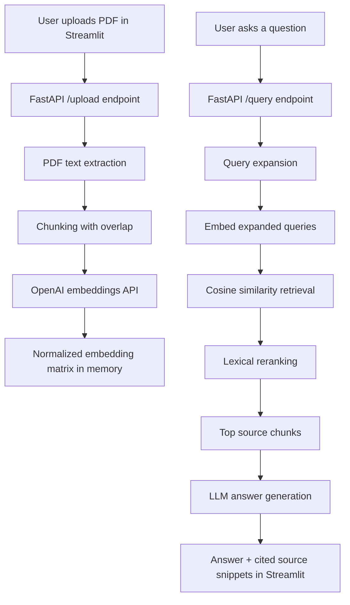

# Research Paper RAG

A lightweight research-paper question answering app built with FastAPI and Streamlit.

Upload a PDF, extract its text, chunk the content, retrieve the most relevant passages, and generate answers grounded in the uploaded document.

## What It Does

- Upload a research paper PDF
- Extract page-level text with PyMuPDF
- Split text into overlapping chunks
- Create embeddings with the OpenAI embeddings API
- Retrieve relevant chunks with cosine similarity
- Expand the user query for broader recall
- Generate an answer with source snippets

## Workflow Diagram



## Core Concepts

- `Chunking`: breaks long paper text into smaller overlapping sections so retrieval stays focused and context is easier to search.
- `Embeddings`: converts text into numerical vectors so semantically related chunks can be found even when wording differs.
- `Cosine similarity`: compares the query vector with document chunk vectors to identify the most relevant sections.
- `Query expansion`: rewrites the user question into multiple search-style variants to improve recall.
- `Reranking`: reorders retrieved chunks so the strongest evidence is sent to the language model.
- `Grounded generation`: asks the LLM to answer using retrieved document context instead of relying only on general knowledge.

## Why This Version Is Lightweight

This project originally used heavier local ML dependencies for embeddings, reranking, and indexing. To make deployment easier on platforms like Render and Streamlit Cloud, the backend now uses:

- OpenAI embeddings instead of local `sentence-transformers`
- NumPy cosine similarity instead of `faiss`
- A lightweight lexical rerank instead of a local cross-encoder reranker

This keeps the core RAG workflow intact while reducing build time, cold starts, and dependency weight.

## Project Structure

```text
.
├── app.py
├── requirements.txt
├── README.md
└── rag_research
    ├── app.py
    ├── main.py
    └── requirements.txt
```

- [app.py](/Users/deveshi/Desktop/rag/app.py): root Streamlit entrypoint for Streamlit Cloud
- [rag_research/app.py](/Users/deveshi/Desktop/rag/rag_research/app.py): frontend UI
- [rag_research/main.py](/Users/deveshi/Desktop/rag/rag_research/main.py): FastAPI backend
- [requirements.txt](/Users/deveshi/Desktop/rag/requirements.txt): root dependency file for frontend deployment

## Local Setup

### 1. Install dependencies

```bash
pip install -r requirements.txt
```

### 2. Set environment variables

Create a `.env` file inside `rag_research/` or export the values in your shell.

```env
OPENAI_API_KEY=your_key_here
OPENAI_MODEL=gpt-4o-mini
OPENAI_EMBEDDING_MODEL=text-embedding-3-small
BACKEND_URL=http://localhost:8000
```

Optional:

```env
OPENAI_BASE_URL=...
AI_PROXY_BASE_URL=...
```

## Run Locally

### Start the backend

```bash
uvicorn rag_research.main:app --reload
```

Backend health check:

```bash
http://localhost:8000/
```

### Start the frontend

```bash
streamlit run app.py
```

Frontend:

```bash
http://localhost:8501/
```

## API Endpoints

### `GET /`

Health check.

Response:

```json
{"status": "ok"}
```

### `POST /upload`

Uploads a PDF, extracts text, chunks it, embeds it, and stores it in memory.

### `GET /query?q=...`

Expands the query, retrieves relevant chunks, reranks them, and generates an answer.

## Deployment

## Backend on Render

Deploy the FastAPI app with a start command like:

```bash
uvicorn rag_research.main:app --host 0.0.0.0 --port $PORT
```

Set these environment variables on Render:

```env
OPENAI_API_KEY=your_key_here
OPENAI_MODEL=gpt-4o-mini
OPENAI_EMBEDDING_MODEL=text-embedding-3-small
```

After deployment, confirm the backend works:

```bash
https://your-render-service.onrender.com/
```

It should return:

```json
{"status":"ok"}
```

## Frontend on Streamlit Cloud

Use:

- Repository root `requirements.txt`
- Main file path: `app.py`

Add this secret in Streamlit Cloud:

```toml
BACKEND_URL = "https://your-render-service.onrender.com"
```

If `BACKEND_URL` is missing, the frontend will fall back to `http://localhost:8000`, which works locally but not on Streamlit Cloud.

## Current Limitations

- Uploaded documents are stored in memory only
- Data is lost when the backend restarts
- Retrieval quality is lighter than a full local reranker setup
- Large PDFs may take longer because embeddings are created at upload time

## Ideas For Next Improvements

- Persist uploaded document state in a database or object store
- Add support for multiple uploaded papers
- Store embeddings for reuse across restarts
- Improve source formatting in the frontend
- Add streaming answers
- Add authentication and per-user document sessions

## Tech Stack

- FastAPI
- Streamlit
- OpenAI API
- NumPy
- PyMuPDF
- Requests

## Demo Summary

This project is a simple end-to-end RAG app for research papers that is easier to deploy than heavier local-ML alternatives, while still preserving the core user experience of upload, retrieve, and answer.
